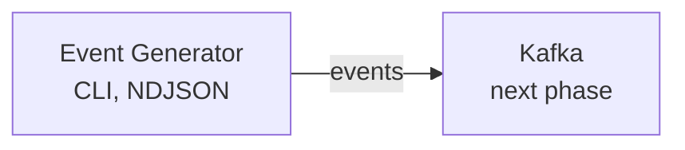

# event-data-platform

An event-driven data platform built step by step. Each new technology is introduced only when a real problem justifies it.

## Status

Phase 1: **Event Generator**, a synthetic e-commerce stream (Brazilian products, prices in BRL)
with coherent customers, products and orders.



Details, the order state machine and the event contract are in
[docs/architecture.md](docs/architecture.md).

## Quick start

```bash
uv sync
uv run pytest
uv run python -m generator --rate 5 --seed 1
```

Sample output (`--format text`, the default):

```
2026-10-04T18:29:36Z order_created ORD-000001
2026-10-04T18:29:36Z order_created ORD-000002
2026-10-04T18:29:38Z order_paid ORD-000001
```

## Usage

```bash
uv run python -m generator --rate 10 --seed 1                  # readable lines
uv run python -m generator --rate 100 --format json            # NDJSON, one event per line
uv run python -m generator --count 50                          # stop after 50 events
uv run python -m generator --dump-catalog products --seed 1    # reference data (also: customers)
```

| Option | Meaning |
| --- | --- |
| `--rate` | Steady-state events per second (default 10). The first minutes emit less. |
| `--seed` | Makes customers, orders and event IDs reproducible. |
| `--count` | Stop after N events (default: run until Ctrl+C). |
| `--format` | `text` (default) or `json` (NDJSON). |
| `--scenario` | `normal` is the only one implemented; the others exit with code 2. |
| `--dump-catalog` | Print `customers` or `products` as NDJSON and exit (needs `--seed`). |

The catalog has 100 real Brazilian products (approximate 2026 retail prices) in
[`generator/data/products.csv`](generator/data/products.csv); edit that file to change it. Events
carry IDs only, so use the same `--seed` for the stream and the catalog dump to make them match.

Events are released in real time and interleave across orders. The generator keeps no order state:
stopping it leaves orders in flight incomplete, on purpose (see the design notes).

## Development

```bash
uv run ruff check .
uv run ruff format --check .
uv run pytest
```

CI runs the same three commands on Python 3.11.

## Roadmap

- [x] `order_created` event and domain models
- [x] Order lifecycle events (paid, shipped, delivered, cancelled)
- [x] CLI with rate control (`python -m generator --rate 10`)
- [x] Real-time interleaved stream and exportable catalog
- [x] CI (ruff + pytest), architecture notes
- [ ] Scenarios: high-load, duplicate, out-of-order (skeleton only: `--scenario` is declared, only `normal` runs)
- [x] v0.1.0 release
