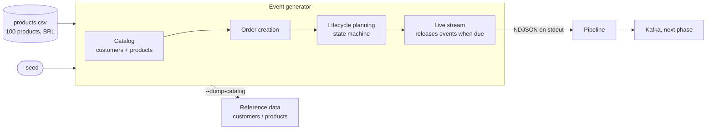
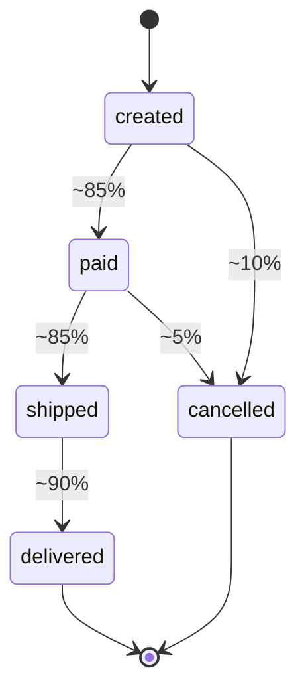

# Architecture

The generator is the first block of the platform. It simulates an online store and emits order
events as a real-time stream; everything downstream (Kafka, quality checks, streaming) will consume
that stream.



## Order lifecycle

Every order starts as `created` and follows the state machine below. The generator only emits legal
transitions; the single source of truth is `TRANSITIONS` in `generator/state_machine.py`, reused by
the generator and by the tests.



Probabilities live in `LifecycleConfig`; whatever is left over means the order stays in its current
state. Delays between two events of the same order are random, 1 to 60 seconds by default.

## Event contract

Every event shares one envelope. Timestamps are UTC, formatted `YYYY-MM-DDTHH:MM:SSZ`.

| Field | Type | Notes |
| --- | --- | --- |
| `event_id` | string | ULID built from the event time plus seeded random bytes |
| `event_type` | string | `order_created`, `order_paid`, `order_shipped`, `order_delivered`, `order_cancelled` |
| `event_version` | int | Bump it whenever a contract changes |
| `event_timestamp` | string | When the event happened at the source |
| `ingestion_timestamp` | string or null | Always `null` at generation; the pipeline fills it in later |
| `order_id` | string | `ORD-000001`, sequential |
| `customer_id` | string | `CUS-000001`, references the customer catalog |

`order_created` adds `items`, a list of `{product_id, quantity, unit_price}`: 1 to 3 distinct
products, quantity 1 to 5, price as a JSON number in BRL, product IDs referencing the product
catalog. The four derived events carry only the envelope, with the same `order_id` and
`customer_id` and a strictly later `event_timestamp` than the previous event of that order.

```json
{"event_id":"01M4438SHS47F2EGKKSVBHQRJ0","event_type":"order_created","event_version":1,"event_timestamp":"2026-10-04T18:36:54Z","ingestion_timestamp":null,"order_id":"ORD-000001","customer_id":"CUS-000004","items":[{"product_id":"PROD-000050","quantity":4,"unit_price":49.9},{"product_id":"PROD-000044","quantity":2,"unit_price":67.89}]}
```

## Reference data

Events carry IDs only. Names, categories and countries live in the catalog, so the platform joins
events against it instead of receiving denormalized events.

- **Products** are read from `generator/data/products.csv` (`name,category,unit_price`); the row
  order defines the ID (`PROD-000001` is the first row).
- **Customers** are generated from the seed (`CUS-000001`, name, country).
- `--dump-catalog customers|products --seed N` prints either one as NDJSON. Use the same seed as
  the event stream so the IDs match.

## Time and ordering

- When an order is created, its whole lifecycle is planned up front. A live stream holds the
  future events in a queue and releases each one when its `event_timestamp` arrives, so the stream
  interleaves orders and is non-decreasing in `event_timestamp`.
- New orders arrive at `rate / average events per order`, which makes `--rate` the steady-state
  events per second. The first minutes emit less, since no order has progressed yet.
- Work is released in ticks of about 10 ms instead of one sleep per event, so 1000 events/s costs
  about 100 sleeps/s.
- Time comes from an injectable clock, and `sleep` is injectable too. Tests run on a virtual clock
  and never wait.

## Reproducibility

The generator uses a private `random.Random(seed)`; the global `random` module is never used. The
same seed gives the same customers, orders, lifecycles and event ID randomness. Only the absolute
timestamps change, because they follow the real clock.

## Design decision: the generator keeps no state

The generator only emits events; it does not store order state. Reconstructing "what is the
current state of order X" from the events is the job of the platform, which is why `order_id` is on
every event. Stopping the generator discards the queue of planned events, so orders in flight stay
incomplete. That is deliberate: orders stuck in `paid` or `created` are realistic, and they give
later phases real cases for data quality checks.

## Not implemented yet

- `--scenario high-load | duplicate | out-of-order`: declared in the CLI, they report "not
  implemented yet" and exit with code 2. They will perturb the ordered stream described above.
- Kafka and everything after it.
